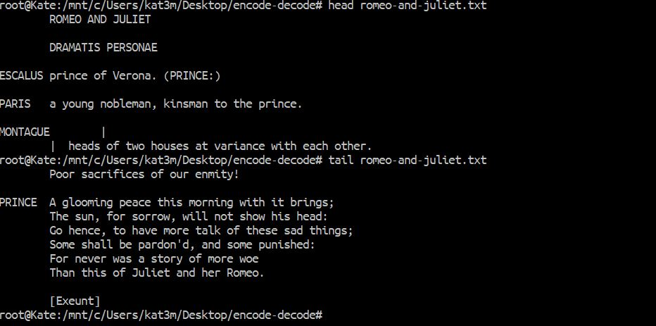
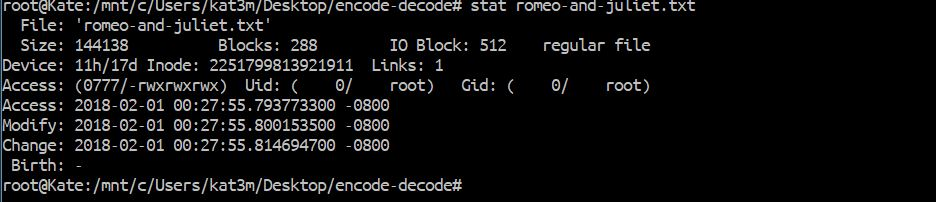
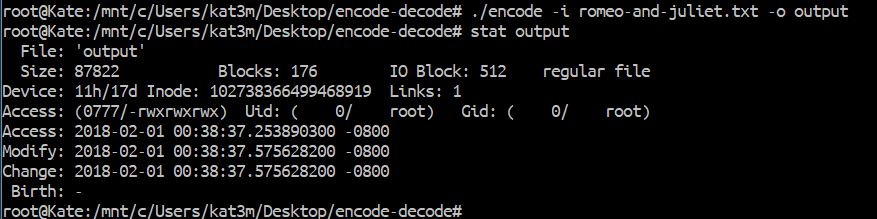
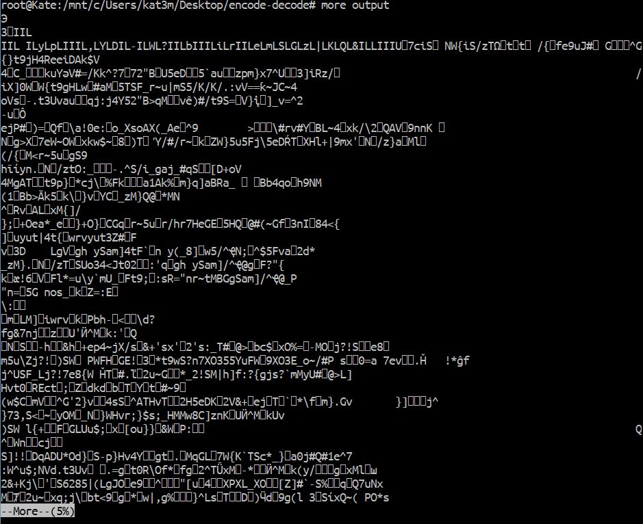
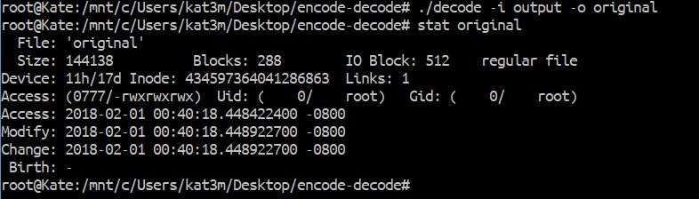
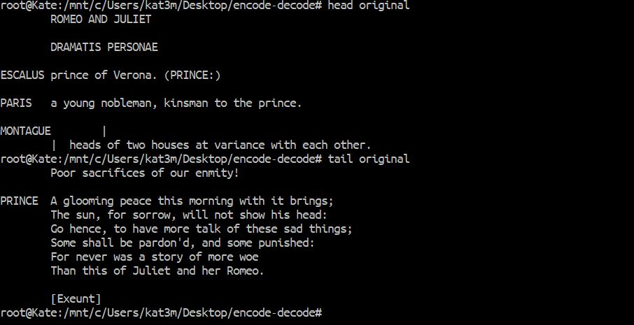

# File Encoder and Decoder

A C program that uses huffman coding to encode and decode files through the command line. This can reduce file sizes by 60% or more!

I made this project for my data structures class along with a partner. I primarily worked on the decoder, but we worked together on the encoder so I could begin to write the decoder.

If you want to use this application, you will need to follow the instructions after the example below to get the program set up on your machine.

## Demo of encoder and decoder



Here we can see the program in action.
I used a txt file containing the script from Romeo and Juliet to use as an example. This is the first and last 10 lines of the text called upon by the head and tail commands.



Here you can see the size of the text file, which is 144138 bytes



Next I encoded the file and put the output in a file I named output. When I check the size of the file, it's 87822 bytes, a whole 56,316 less!! About 60% smaller! 



Viewing the contents of output, we can see that our file has been encoded. You can sort of make out the beginning which is the magic number and the code to reconstruct the tree which has I's and L's followed by each symbol used. The rest is impossible for any human to comprehend, it is the series of bits the encoder will read to reconstruct the text.



The encoded file is clearly unreadable to any human, so we must use our decoder to bring the file back to its original state. I use decode to take in the encoded file and decode it, putting it's output in a file called original. When the file is decoded, it is identical to the file before it was encoded. As we see here it's back to 144138 bytes.



Just to show that the text is exactly the same as it was before, here's the output of head and tail run on the decoded file.

There you have it, an encoder and decoder written in C using Huffman Coding!

## Prerequisites

In order to compile this program you must have Java and GCC installed.

## Installation

Heres how to get this application up and running on your machine.

Clone this repository using git

```
git clone https://github.com/katekaho/encode-decode.git
```

Next, navigate into the folder you just created and run the following to comile the program:

```
$ make all
```

Once the program is compiled, you should have the encode and decode files in your directory.

If you want to remove the compiled files type:

```
$ make clean
```

## Commands

### Encoding

To encode a file, call the program encode using ./encode, followed by the -i (input) flag which specifies the input file.

To specify the output file, use the -o (output) flag followed by the name of the file you want the encoded text to go in. 

```
$ ./encode -i nameOfFileToEncode -o encodedFile
```


### Decoding

To decode the encoded file, use flag -i (input) followed by the name of the file you want to decode.
Then use flag -o (output) followed by the name of the file you want the decoded infomation to go in.

```
./decode -i encodedFile -o decodedFile
```

By default, if no output is specified, decode will write to standard out.

```
./decode -i encodedFile
```

## Challenges

Being unfamiliar with C programming, it took a lot of understanding on how memory works in order to get this working. Figuring out how to fix memory leaks in the application took a lot of debugging.

## Application Architecture
### Encode: 
- histogram of size 256 to store frequency of each symbol
- queue with frequency and symbol, used to build huffman tree by joining symbols together by frequency continuously until only one element left
- code table which puts the correct path of the characters in the huffman tree into a code
- bit vector which gets repetitively set according to our code table while reading file and writes to output each time it gets full

### Decode:
- tree reconstructor
- char array to store all the decoded charactors
- bit vector to use to step through tree until pointer hits a leaf


